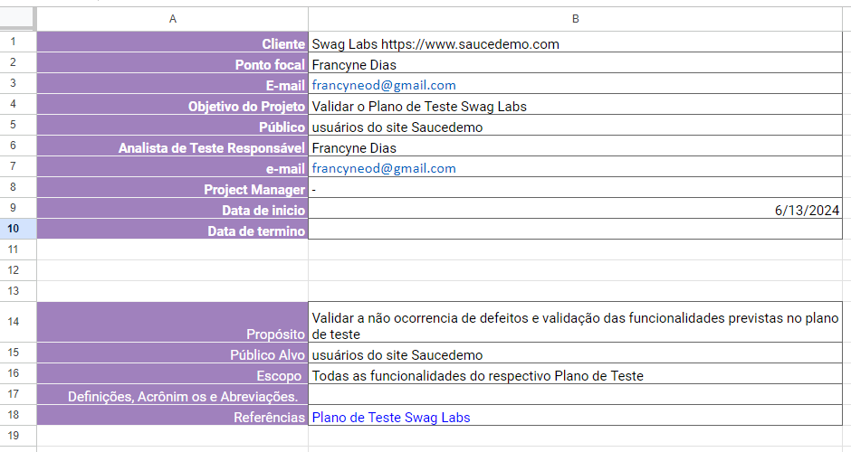
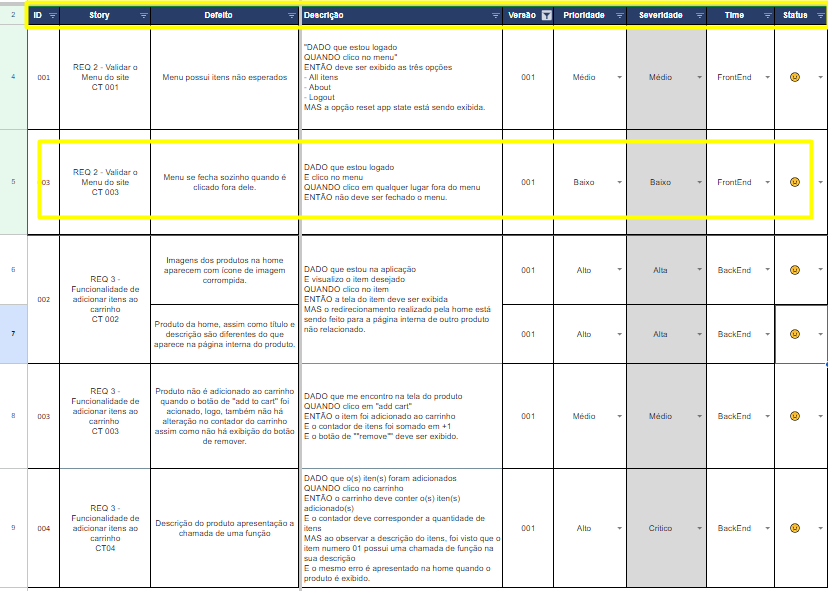

# Controle de Bugs

## Plano de controle
Primeiro aba da ferramenta contem as informações de identificação do projeto.

## Controle de Defeitos
Na aba Controle de Bugs, contém todos os defeitos registrados, assim como sua descrição, story, versão do software testado, prioridade, severidade, time responsável e indicador de status.

- Defeito: Um título breve e claro do defeito aberto.
- Descrição: A descrição utiliza Gherkin para detalhar o passo a passo de como o defeito foi encontrado.
- Story: A história da respectiva funcionalidade, juntamente com o ID do caso de teste.
- Prioridade: A prioridade determina a ordem de correção de um defeito, ou seja, quão urgente é resolver o problema.
- Severidade: Indica o impacto de um defeito no funcionamento do sistema. É uma medida que avalia a gravidade do problema e como ele afeta o desempenho ou usabilidade do software.
- Time responsável: O provável time responsável por aquela funcionalidade não estar funcionando corretamente.
- Indicador de Status: É uma representação visual do resultado do teste.

Esta planilha foi disponiblizado pela Priscila de Araujo Caimi, da plataforma Qualiters Club no curso de Planejamento e Execução de testes.

