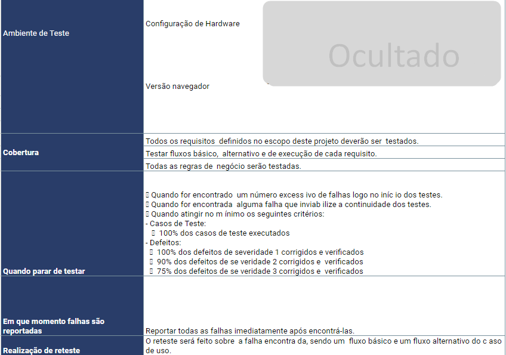

# Plano de Teste

## Planilha Plano de Teste
- Feito por Google Planilhas.

### Introdução do plano

## Escopo

Na aba Escopo da planilha irá conter todos os levantamentos de requisitos, critério de aceite, os tipos de testes que serão realizados, assim como a prioridade e severidade deles. Além da meta e progresso de cada um.

## Apresentação da suite

ID: Cada id representa um caso de teste (CT) e respectivamente o número deste caso de teste.

Critérios de Aceite: São as condições escritas em Gherking que o teste deve cumprir para passar.

Prioridade: A prioridade determina a ordem de correção de um defeito.

Severidade: Indica o impacto de um defeito no funcionamento do sistema. É uma medida que avalia a gravidade do problema e como ele afeta o desempenho ou usabilidade do software.

Resultado Esperado: É o que deveria acontecer quando o teste é executado corretamente.

Resultado Obtido: Onde o "OK" são para testes que passaram e "NOK" para testes que foi registrado algum bug.

Registro de Defeito: É uma forma de documentar defeitos e bugs com evidências. Cada bug tera um ID comecando pelo 001, e sera documentado na planilha de Controle de Bugs.

Indicador de Status: É uma representação visual do resultado do teste.

### Suite - Login

Na aba suite_login tem como objetivo validar a funcionalidade login, como o critério de aceite. Contém o caso de teste funcional que valida a função anterior.

### Suite - Menu

Na aba Suite validar_menu tem como objetivo validar a funcionalidade do menu do site, como o critério de aceite. Contém o caso de teste funcional que valida a função anterior.

### Suite - Adicionar Itens

Na aba Suite adicionar_itens tem como objetivo validar a funcionalidade de adicionar itens ao carrinho, como o critério de aceite. Contém o caso de teste funcional que valida a função anterior.

### Suite - Remover Itens 

Na aba Suite remover_itens tem como objetivo validar a funcionalidade de remover itens do carrinho, como o critério de aceite. Contém o caso de teste funcional que valida a função anterior.

### Suite - Filtrar Itens

Na aba Suite remover_itens tem como objetivo validar a funcionalidade de remover itens do carrinho, como o critério de aceite. Contém o caso de teste funcional que valida a função anterior.

